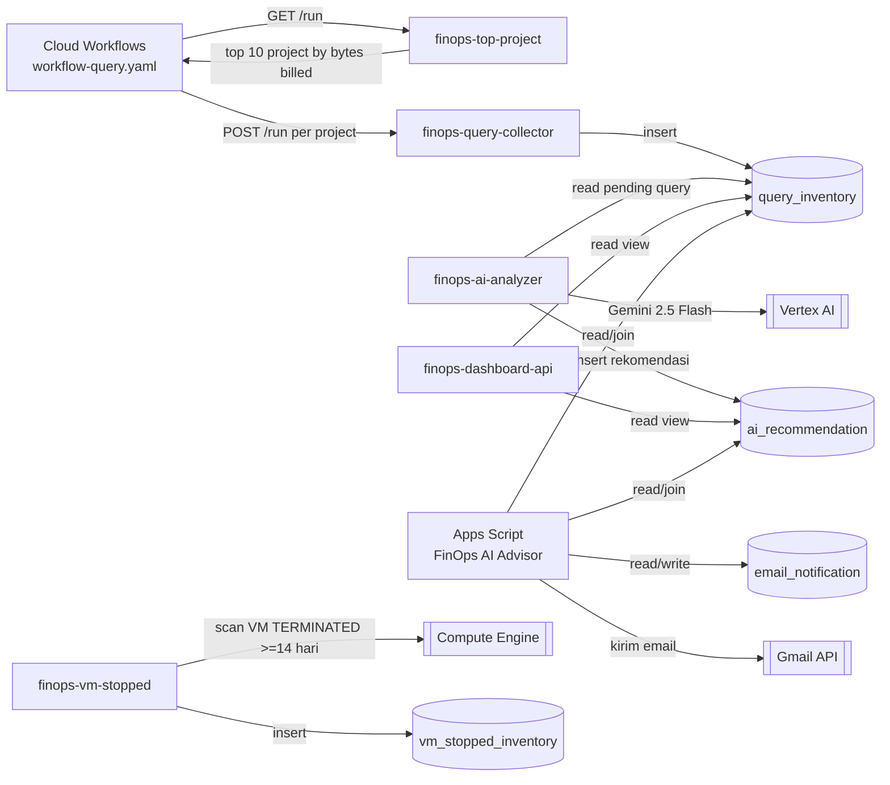

# IOH Automation – FinOps AI Advisor

Kumpulan service & automation untuk memantau biaya query BigQuery, mendeteksi VM yang mubazir, menghasilkan rekomendasi optimasi berbasis AI (Gemini), dan mengirimkan notifikasi ke pemilik query lewat dashboard Google Apps Script.

- **BigQuery project:** `ck-finops-data-prd-in60`
- **Dataset:** `finops_ai`
- **Region Cloud Run / Workflows:** `asia-southeast2`

## Ringkasan Arsitektur



Alur singkat:

1. **Cloud Workflows** (`workflow/workflow-query.yaml`) memanggil `finops-top-project` untuk mendapatkan 10 project dengan `total_bytes_billed` terbesar dalam 1 hari terakhir (dari `INFORMATION_SCHEMA.JOBS_BY_ORGANIZATION`).
2. Untuk setiap project, workflow memanggil `finops-query-collector` yang menarik 20 query terberat (`INFORMATION_SCHEMA.JOBS_BY_PROJECT`) dan menyimpannya ke tabel `query_inventory`.
3. `finops-ai-analyzer` mengambil query `SELECT` yang belum dianalisis dan `total_bytes_billed > 1GB`, mengirimkannya ke Gemini (`gemini-2.5-flash`) untuk dianalisis root cause, severity, rekomendasi, dan optimized SQL, lalu menyimpannya ke `ai_recommendation`.
4. `finops-dashboard-api` menyediakan endpoint read-only (`/summary`, `/dashboard`) di atas view BigQuery untuk konsumsi dashboard eksternal.
5. **Apps Script Dashboard** (`appscript/`) adalah web app internal ("FinOps AI Advisor") tempat tim FinOps melihat temuan, membuka detail rekomendasi, menyimpan CC email, mengirim email rekomendasi (manual atau terjadwal per jam), serta melihat laporan email yang sudah terkirim. Status pengiriman dicatat di tabel `email_notification`.
6. `finops-vm-stopped` memindai VM Compute Engine yang berstatus `TERMINATED` selama >= 14 hari per project dan mencatatnya (tabel `vm_stopped_inventory`, dibuat manual di BigQuery — skema belum ada di repo ini).

## Struktur Folder

```
.
├── appscript/                  # Google Apps Script – dashboard web app "FinOps AI Advisor"
│   ├── Code.gs                 # Entry point (doGet), query dashboard, kontrol auto-send trigger
│   ├── testDashboard().gs      # Fungsi kirim email, simpan CC, batch auto-send
│   ├── Dashboard.html          # UI dashboard (Bootstrap + Chart.js)
│   └── appscript.json          # Manifest (scopes, advanced services, deployment)
├── finops-top-project/         # Cloud Run: cari top 10 project pemakai BigQuery
├── finops-query-collector/     # Cloud Run: kumpulkan query berat per project
├── finops-ai-analyzer/         # Cloud Run: analisis query via Gemini, simpan rekomendasi
├── finops-dashboard-api/       # Cloud Run: REST API read-only untuk dashboard eksternal
├── finops-vm-stopped/          # Cloud Run: deteksi VM yang sudah lama berhenti
├── workflow/workflow-query.yaml# Definisi Google Cloud Workflows (orkestrasi harian)
├── ServiceAccount               # Daftar IAM role yang dibutuhkan service account BigQuery
├── ai_recommendation            # DDL tabel ai_recommendation
├── email_notification           # DDL tabel email_notification
├── finops_summary                # DDL tabel finops_summary (ringkasan untuk dashboard executive)
├── optimization_tracking         # DDL tabel optimization_tracking (ROI tracking)
└── query_inventory                # DDL tabel query_inventory
```

## BigQuery – Dataset `finops_ai`

| Tabel | Fungsi | Definisi |
|---|---|---|
| `query_inventory` | Semua query berat yang ditemukan dari `INFORMATION_SCHEMA`, di-*partition* by `inserted_at`, *cluster* by `project_id, user_email` | [query_inventory](query_inventory) |
| `ai_recommendation` | Hasil analisis Gemini per `query_id` (severity, root cause, rekomendasi, optimized SQL) | [ai_recommendation](ai_recommendation) |
| `email_notification` | Tracking email rekomendasi yang sudah dikirim ke user (`recipient`, `cc_email`, `email_sent`, `sent_at`, `acknowledged`) | [email_notification](email_notification) |
| `optimization_tracking` | Perbandingan bytes billed sebelum/sesudah optimasi, dipakai untuk laporan ROI ke customer | [optimization_tracking](optimization_tracking) |
| `finops_summary` | Ringkasan harian untuk dashboard executive | [finops_summary](finops_summary) |
| `vm_stopped_inventory` | Inventaris VM yang sudah `TERMINATED` >= 14 hari (dipakai oleh `finops-vm-stopped`, skema belum ada di repo) | – |

Dashboard (Apps Script maupun `finops-dashboard-api`) membaca dari **view** BigQuery (`v_finops_dashboard_v2`, `v_finops_ai_dashboard`) yang menggabungkan `query_inventory` + `ai_recommendation`. View ini dibuat manual di BigQuery dan belum termasuk dalam repo.

## Cloud Run Services

Semua service memakai pola Docker yang sama: Python 3.12-slim, Flask, dijalankan dengan Gunicorn di port 8080.

| Service | Endpoint | Deskripsi |
|---|---|---|
| `finops-top-project` | `GET /run` | Ambil 10 project dengan bytes billed terbesar (1 hari terakhir) |
| `finops-query-collector` | `POST /run` `{ "project_id": "..." }` | Kumpulkan 20 query terberat per project ke `query_inventory` |
| `finops-ai-analyzer` | `GET /run` | Analisis hingga 10 query pending via Gemini, simpan ke `ai_recommendation` |
| `finops-dashboard-api` | `GET /summary`, `GET /dashboard` | REST API read-only untuk konsumsi eksternal |
| `finops-vm-stopped` | `POST /run` `{ "project_id": "..." }` | Deteksi VM yang berhenti >= 14 hari |

### Deploy contoh (sesuaikan nama service & project)

```bash
gcloud run deploy finops-query-collector \
  --source ./finops-query-collector \
  --project ck-finops-data-prd-in60 \
  --region asia-southeast2 \
  --no-allow-unauthenticated
```

Ulangi untuk service lain dengan mengganti folder sumber. Endpoint dipanggil secara internal (OIDC auth) oleh Cloud Workflows, sehingga service **tidak** perlu `--allow-unauthenticated`.

### Deploy Workflow

```bash
gcloud workflows deploy workflow-query \
  --source=workflow/workflow-query.yaml \
  --project ck-finops-data-prd-in60 \
  --location asia-southeast2
```

Jadwalkan eksekusi harian lewat Cloud Scheduler yang memanggil workflow ini.

## Apps Script Dashboard (`appscript/`)

Web app "FinOps AI Advisor" untuk tim FinOps:

- Filter temuan by tanggal, project, severity.
- Detail rekomendasi AI + SQL yang sudah dioptimasi.
- Simpan CC email & kirim email rekomendasi manual (Gmail API), termasuk notice untuk memakai [Agentspace](https://agentspace.ioh.co.id) sebelum menjalankan query.
- Auto-send scheduler (trigger per jam via `runAutoSendBatch`) untuk mengirim batch rekomendasi yang belum dioptimasi.
- Laporan "Sent Email Report" — daftar email yang sudah terkirim (`getSentEmailList`).

### Deploy

Gunakan [clasp](https://github.com/google/clasp) atau paste manual isi `Code.gs`, `testDashboard().gs`, `Dashboard.html` ke Apps Script editor, lalu:

```bash
clasp push
clasp deploy
```

`appscript.json` saat ini di-set `"access": "MYSELF"` — ubah ke `"ANYONE_ANONYMOUS"`/`"DOMAIN"` sesuai kebutuhan bila web app perlu diakses user lain.

## Service Account / IAM

Service account yang dipakai oleh Cloud Run & Apps Script (BigQuery) minimal memerlukan role berikut (lihat [ServiceAccount](ServiceAccount)):

- `roles/bigquery.resourceViewer`
- `roles/bigquery.jobUser`
- `roles/bigquery.dataEditor`
- `roles/browser` (resolve project display name via Cloud Resource Manager, dipakai `finops-top-project`)

`finops-vm-stopped` juga memerlukan izin `compute.instances.list` (mis. `roles/compute.viewer`) untuk memindai VM lintas project.

## Catatan

- Skema tabel `vm_stopped_inventory` dan view `v_finops_dashboard_v2` / `v_finops_ai_dashboard` belum ada di repo — pastikan dibuat manual di BigQuery sebelum deploy service yang bergantung padanya.
- URL Cloud Run pada `workflow-query.yaml` masih placeholder (`finops-top-project-xxxx...`) — ganti dengan URL hasil deploy sebenarnya.
